# STI Process Simulation and Cone Defect Analysis

**A Synopsys Sentaurus Process study of STI fabrication, micromasking-induced cone defects, oxide thinning, and the electric-field reliability risk they create**

Shallow Trench Isolation (STI) · TCAD · Synopsys Sentaurus Process · 180 nm educational reference node · RIE micromasking · cone defect · trench geometry · local oxide thinning · field enhancement · dielectric reliability

> **Evidence status. Please read this first.**
> This repository documents a TCAD course project (VIT, School of Electronics Engineering). The original Sentaurus command files and `.tdr` structures **are not in this repository**. The evidence that is here comes in three kinds:
>
> | Tag | Meaning |
> |---|---|
> | **Reported** | Stated in the project report. Not re-extracted from a TCAD structure. |
> | **Estimated** | Measured from the pixels of three genuine Sentaurus Visual screenshots ([`assets/tcad/`](assets/tcad/)) by [`measure_tcad_screenshots.py`](scripts/analysis/measure_tcad_screenshots.py), ±10–15 nm. |
> | **Calculated** | Plain arithmetic on reported values, in [`report_consistency_check.py`](scripts/analysis/report_consistency_check.py). |
>
> The project ran **no** electrical, stress, leakage, or lifetime simulation. The reliability sections below explain the mechanisms; they are not simulation results. The full audit is in [docs/audit.md](docs/audit.md).

---

## Key Process Parameters

| Parameter | Value | Source | Screenshot estimate |
|---|---:|---|---:|
| Technology | 180 nm CMOS (educational reference node) | Reported | – |
| Tool | Synopsys Sentaurus Process; structures viewed in Sentaurus Visual | Reported / screenshots | – |
| Substrate | p-type (boron) Si, (100) | Reported | – |
| Substrate doping | 1.4 × 10¹⁵ cm⁻³ | Reported | – |
| Pad oxide | 12 nm | Reported | too thin to resolve |
| Si₃N₄ hard mask | 120 nm | Reported | ≈ 140–145 nm |
| Trench depth | 200 nm | Reported | ≈ 220–230 nm (+ notch, see below) |
| Trench width (top) | 180 nm | Reported | ≈ 380–390 nm at Si surface |
| Aspect ratio | ~1.1 | Reported (calc. 1.11) | ≈ 0.6 |
| Cone defect height | 100 nm | Reported | not observed as a cone (see [Cone defect](#cone--spike-defect)) |
| Cone tip radius | ~10 nm (8–12 nm in §6.1) | Reported | not resolvable |
| HDP oxide thickness | 400 nm | Reported | – |
| CMP removal rate | "Standard" (no number given) | Reported | – |

The trench, defect, and nitride numbers differ between the report and the screenshots. Both columns are shown on purpose. [docs/geometry-analysis.md](docs/geometry-analysis.md) explains the differences.

---

## Why Shallow Trench Isolation?

STI separates neighbouring active regions with an oxide-filled trench etched into the silicon. The process has three steps:

1. **Trench formation.** A pad-oxide / nitride hard mask defines the isolation area. Anisotropic RIE then cuts a near-vertical trench.
2. **Oxide fill.** HDP-CVD fills the trench with SiO₂.
3. **Planarization.** CMP removes the excess oxide and stops on the nitride.

STI replaced LOCOS because its isolation boundary has no bird's-beak encroachment into the active area. That makes the trench oxide the main dielectric between devices. Any process defect that thins the oxide or sharpens a silicon surface therefore sits on the voltage path between active regions, and that is why this project studies a trench-bottom defect.

## Cone / Spike Defect

During silicon RIE, small particles of etch byproduct, redeposited resist, or nitride can land on the trench floor. Each particle acts as a **micromask**: the silicon under it is protected while the exposed floor keeps etching. The report describes the result as a silicon spike that rises from the trench bottom into the trench volume. Its sharp tip is the critical reliability feature.

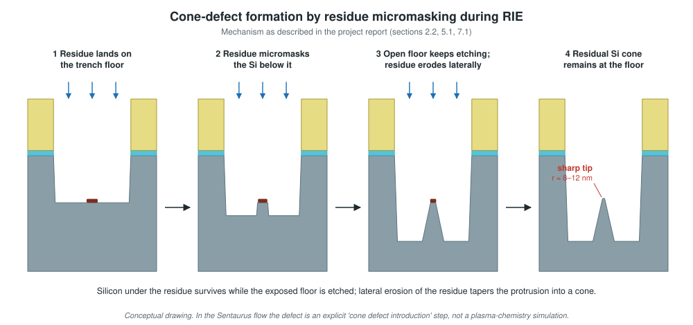

**How the defect was produced in this project:** the report calls step 6 *"Cone Defect Introduction: the analytical distinguishing step of the simulation"*. The defect is an **explicitly modelled** process step. It is not the output of a plasma-chemistry etch model.

**What the TCAD screenshots show:** the cut planes do not show an upward silicon spike. They show a **narrow recess about 105–115 nm deep and about 40–60 nm wide below the trench floor**. The recess is empty (gas) after the etch and oxide-filled after deposition. Its depth is close to the reported 100 nm "cone height", but its direction is reversed. Without the command file, the cause cannot be determined; see [docs/cone-defect-formation.md](docs/cone-defect-formation.md).

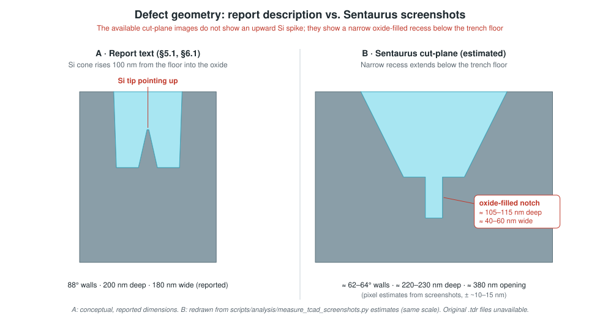

---

## Process Flow

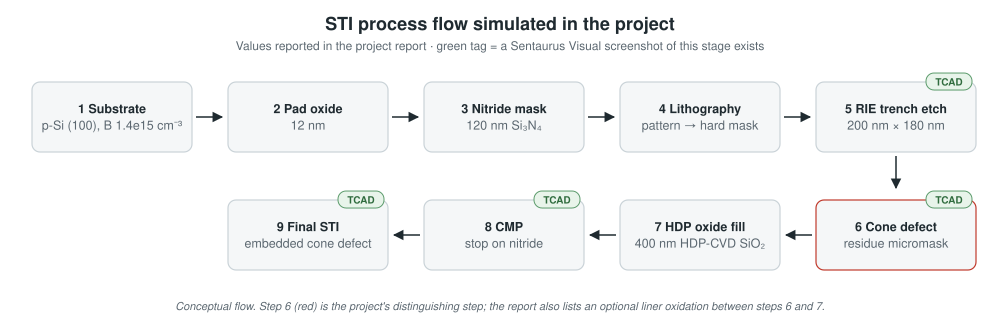

Each stage is documented in [docs/sti-process-flow.md](docs/sti-process-flow.md) under Purpose / Material / Process / Geometry change / Output. The report gives no temperatures, pressures, doses, gas chemistries, or rates, and none are invented here.

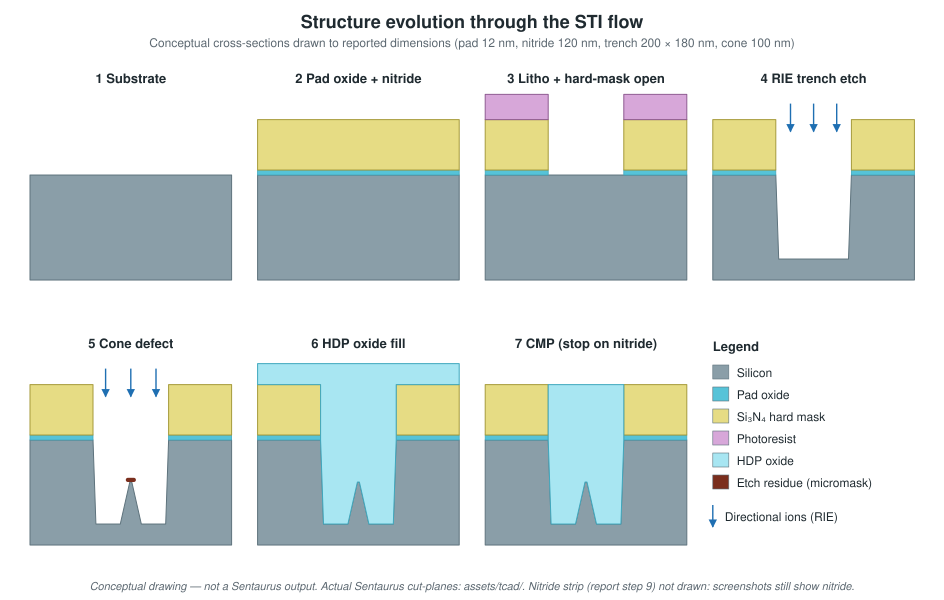

### Initial Structure

- **Substrate:** boron-doped silicon at **1.4 × 10¹⁵ cm⁻³** (Reported). The report quotes ≈ 10 Ω·cm, and the Masetti hole-mobility model gives **9.7 Ω·cm** (Calculated).
- **Orientation:** (100) (Reported).
- **Assumption:** the substrate starts defect-free, so every defect in the final structure comes from the process (Reported, §3.3).
- **Domain (screenshots):** a 3D block about 1 µm × 1 µm in footprint and 1.5 µm deep, with a square isolation opening. It is shown as a 2D cut at Y = 0.5 (Estimated).

### Pad Oxide

A **12 nm** (Reported) SiO₂ buffer between the silicon and the nitride. It relieves the stress caused by the different elastic properties and lattice mismatch of Si and Si₃N₄. Without it, crystal defects would form at the Si/SiN interface. The report gives a 10–15 nm design range and gives no oxidation conditions.

### Nitride Hard Mask

**120 nm** (Reported) LPCVD Si₃N₄. The nitride resists the F/Cl silicon-etch chemistry, so it protects the active regions during RIE. It later serves as the **CMP polish stop** (Reported, §3.2). The screenshots suggest ≈ 140–145 nm, which is near the ±15 nm resolution limit of the measurement.

### Lithographic Patterning

The resist is exposed with the isolation mask and developed. The pattern is transferred through the nitride and pad oxide, the resist is stripped, and silicon is exposed only where trenches will be etched. The report gives no wavelength, resist thickness, dose, or time.

### Anisotropic Trench Etching (RIE)

Directional ion bombardment combined with chemical etching gives near-vertical sidewalls. The trench is wider at the top than at the bottom (positive taper). The sharp top corners at the active-region edge are stress and field concentration sites.

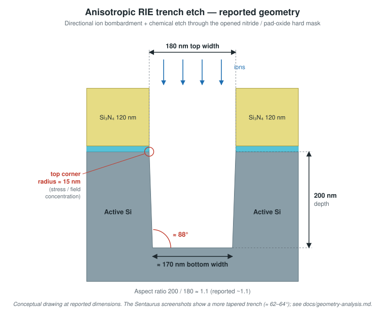

| Feature | Reported | Calculated from reported | Estimated from screenshots |
|---|---:|---:|---:|
| Depth | 200 nm | – | ≈ 220–230 nm |
| Top width | 180 nm | – | ≈ 380–390 nm |
| Bottom width | ≈ 170 nm | 166 nm from 88° walls | ≈ 155–165 nm |
| Sidewall angle | ≈ 88° | 88.6° from the widths | ≈ 62–64° |
| Top-corner radius | ≈ 15 nm | – | not resolvable |

### Cone Defect Formation

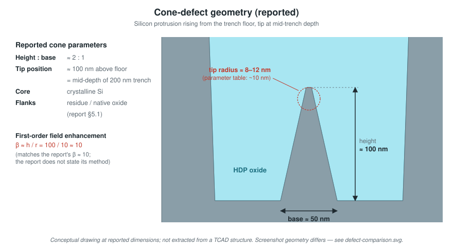

| Feature | Reported |
|---|---:|
| Height | ≈ 100 nm (tip at mid-trench depth) |
| Base diameter | ≈ 50 nm |
| Tip radius | ≈ 8–12 nm (table: ~10 nm) |
| Height : base | 2 : 1 (Calculated: 2.0) |
| Composition | crystalline Si core; residue or native-oxide flanks |

### HDP Oxide Fill

HDP-CVD (**400 nm**, Reported) fills the trench from the bottom up. Simultaneous deposition and sputter-etch reduces voids, and the report mentions a trace fluorine doping for better gap fill. The oxide coats the cone, but the report states that the oxide near the tip ends up **thinner** than on its flanks. That thin region is the electrical weak point. The report gives no deposition rate.

### Chemical Mechanical Planarization

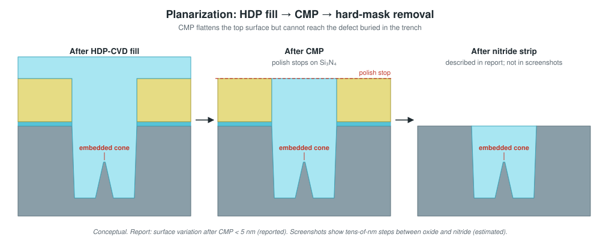

CMP removes the oxide above the hard mask, with the nitride acting as the polish stop. According to the report, the nitride is then stripped in hot phosphoric acid. The report states that **the cone remains embedded inside the filled trench and is untouched by CMP**: planarization fixes the topography but cannot remove a buried defect.

- Reported planarity: **< 5 nm** surface height variation after CMP.
- Screenshots: the oxide in the opening sits ≈ 70 nm below the nitride top (`FinalSTI`), or ≈ 20 nm below it with ≈ 40 nm of oxide left on the nitride (`final_structure`). Nitride is still present in both (Estimated).

### Final Structure

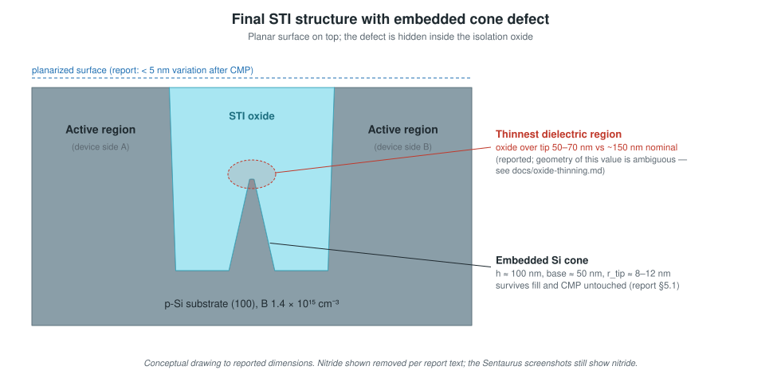

Two active regions are separated by an oxide-filled trench under a planar top surface. The embedded silicon cone at the trench bottom is the region with the thinnest dielectric, so it carries the highest local field.

**Genuine Sentaurus Visual output** (cropped from the report's screenshots; the window title bars were removed because they contain a private server path):

| After etch + defect (`ConeDefect_fps_geometry`) | After fill / planarization (`Review1_Fig1_FinalSTI_fps_geometry`) | Final (`final_structure_fps_geometry`) |
|:---:|:---:|:---:|
| 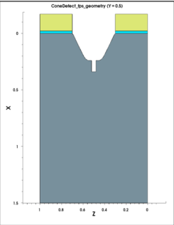 | 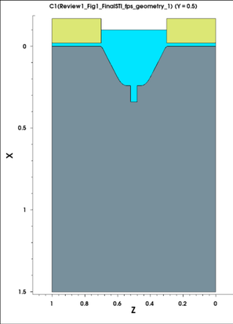 | 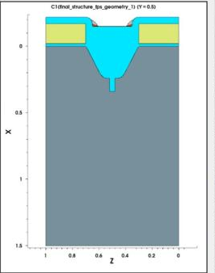 |
| 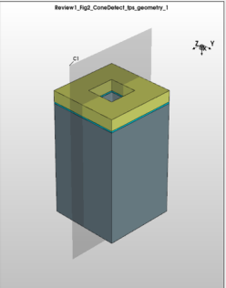 | 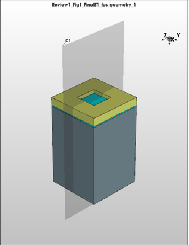 | 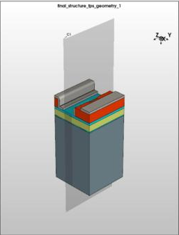 |

Colours: grey = Si, yellow = Si₃N₄, cyan = SiO₂, white = gas. Axes are in µm (X = depth, Z = lateral). The original screenshots are low resolution (≈ 5–7 nm per pixel).

---

## Geometric Analysis

Full analysis: [docs/geometry-analysis.md](docs/geometry-analysis.md). Raw numbers: [results/screenshot-measurements.csv](results/screenshot-measurements.csv) and [results/report-consistency-check.md](results/report-consistency-check.md).

Findings:

- The report's trench numbers agree with each other. The aspect ratio is 1.11, and 88° walls on a 200 nm-deep, 180 nm-wide trench give a 166 nm bottom against the reported 170 nm.
- The screenshots show a deeper, wider, and much more tapered trench (≈ 62–64°) with a narrow sub-trench recess.
- The reported cone ratio (100 / 50 = 2 : 1) is consistent. The cone itself cannot be measured from the available images.

## Local Oxide Thinning

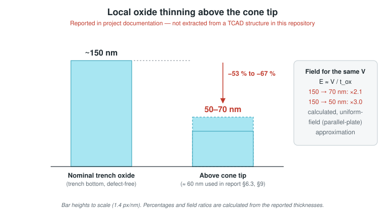

| Quantity | Value | Source |
|---|---:|---|
| Nominal trench-bottom oxide | ~150 nm | Reported |
| Oxide above the cone tip | 50–70 nm (≈ 60 nm in §6.3, §9) | Reported |
| Local reduction | 53–67 % ("> 50 %", "−60 %" in report) | Calculated |
| Field increase from thinning alone, same voltage | ×2.1 to ×3.0 | Calculated (E ≈ V / t) |

For a fixed voltage across the isolation, a thinner dielectric carries a proportionally higher field. Thinning alone therefore raises the local field 2–3×, **before** the tip-geometry enhancement is applied.

Caveat: the stated geometry cannot reproduce these two thicknesses directly. A tip at mid-depth of a 200 nm trench leaves ≥ 100 nm of vertical oxide when the fill is flush with the silicon. See [docs/oxide-thinning.md](docs/oxide-thinning.md).

## Electric-Field Enhancement

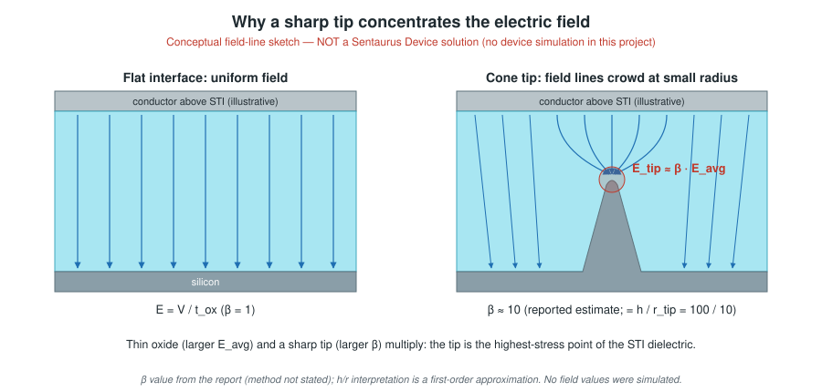

Field lines terminate densely on a sharply curved conductor, so the local field at the tip exceeds the average oxide field: E_tip ≈ β · E_avg. The smaller the tip radius, the larger β.

- **β ≈ 10.** This is the report's estimate and is **not a simulated value**. It equals the first-order protrusion estimate h / r = 100 nm / 10 nm (Calculated). The report does not state which method it used.
- The report cites a literature range of 3–8× for cone defects (§2.3).
- The report's "80–100 MV/cm at the tip" figure assumes an average oxide field of 8–10 MV/cm. No bias condition is defined, so this figure is **not** a project result.
- No Sentaurus Device (electrical) simulation was performed. The report lists it as future work (§10.1).

Details: [docs/electric-field-analysis.md](docs/electric-field-analysis.md).

## Reliability Impact

Cone defect → sharp tip → field enhancement **combined with** oxide thinning → higher local dielectric stress → higher breakdown risk → potential leakage and reliability degradation.

| Mechanism | Status in this project |
|---|---|
| Trap-assisted tunneling (TAT), Fowler-Nordheim tunneling | Discussed in the report as leakage paths. **Not simulated.** |
| Mechanical stress (Si/SiO₂ thermal-expansion mismatch; tensile in oxide near tip, compressive in Si) | Interpretation in the report. **Not simulated.** |
| Premature dielectric breakdown | Discussed. **Not simulated.** |
| TDDB, SILC, HCI | Discussed as qualification test methods (§8.2). **Not simulated.** |

The report's §6.3 table gives relative breakdown voltage, leakage, and TDDB-lifetime figures, but it states no method and they are not backed by any simulation, so this repository does not repeat them as results. Details: [docs/reliability.md](docs/reliability.md).

## Validation Approach

The report proposes validation against published experimental and process-model data:

- trench depth and sidewall angle against SEM cross-sections from the literature
- oxide fill against void-fill criteria
- post-CMP planarity against profilometry

**No comparison data, overlay, or measurement appears in the report or this repository**, so the project is **not experimentally validated**. See [docs/validation.md](docs/validation.md).

## Simulation Methodology

The workflow is: domain → substrate → materials → hard mask → pattern → trench etch → defect insertion → HDP fill → CMP → geometry inspection. The cross-section domain covers one trench plus portions of the adjacent active regions. The report describes adaptive mesh refinement near geometric complexity and steep gradients, but gives no mesh statistics. See [docs/simulation-methodology.md](docs/simulation-methodology.md) and [docs/reproduction.md](docs/reproduction.md).

## Results

[docs/results.md](docs/results.md) lists every number with its source tag. In summary:

| Metric | Value | Source |
|---|---:|---|
| Trench depth / width | 200 nm / 180 nm | Reported |
| Sidewall angle | ≈ 88° | Reported |
| Trench geometry in screenshots | ≈ 220–230 nm deep, ≈ 380–390 nm opening, ≈ 62–64° walls | Estimated |
| Cone height / base / tip radius | 100 nm / 50 nm / 8–12 nm | Reported |
| Defect feature in screenshots | ≈ 105–115 nm deep, ≈ 40–60 nm wide recess below floor | Estimated |
| Nominal oxide / oxide over tip | ~150 nm / 50–70 nm | Reported |
| Oxide reduction | 53–67 % | Calculated |
| Post-CMP surface variation | < 5 nm | Reported |
| Field-enhancement factor | β ≈ 10 | Reported estimate (= h/r, Calculated) |

## Engineering Tradeoffs

These are engineering interpretation, not simulation output.

- **Better isolation vs. process complexity.** STI removes bird's-beak encroachment but adds an RIE step, an HDP fill, and CMP, and each step is a new place for defects to form.
- **Aggressive trench geometry vs. defect sensitivity.** Deeper, narrower trenches isolate better, but they need longer, more polymerizing etches. Those give residue more time to micromask the floor.
- **Etch anisotropy vs. corner stress.** Near-vertical walls save area but leave sharp top corners (≈ 15 nm radius reported). Liner oxidation or corner rounding trades area for lower stress and field.
- **Tip radius vs. field concentration.** With β ≈ h / r, halving the tip radius roughly doubles the local field. Sacrificial oxidation that blunts small cones (the report gives ≲ 20 nm as effective) attacks r directly.
- **Oxide thickness vs. isolation reliability.** Field scales as 1 / t, so the 50–70 nm local oxide over the tip gives up most of the margin of the ~150 nm nominal oxide.
- **HDP gap fill vs. defect conformity.** Sputter-assisted HDP fills without voids, but its redistribution leaves thinner oxide on top of a protrusion than on its flanks. This is the thinning mechanism the report describes.

## Technical Learnings

- **Process-flow modelling:** turning a nine-step STI module (substrate, pad oxide, LPCVD nitride, lithography, RIE, defect insertion, optional liner, HDP-CVD, CMP) into an ordered TCAD sequence with explicit layer thicknesses.
- **Hard-mask engineering:** why a pad-oxide buffer sits under the nitride, and why the nitride does double duty as etch mask and CMP stop.
- **Anisotropic etching and micromasking:** how directional ion flux plus a local etch-resistant deposit leaves a residual silicon protrusion, and how lateral erosion of the deposit sets the taper.
- **Defect modelling in TCAD:** inserting a defect as an explicit geometric step (rather than relying on plasma physics), then carrying it through fill and CMP.
- **Gap fill and planarization:** why CMP cannot remove buried defects, and how a polish stop defines the final surface.
- **3D domain and 2D cut planes:** reading Sentaurus Visual cut planes (X depth, Z lateral) and the materials list (Si, Oxide, Nitride, Gas).
- **Geometry extraction:** recovering trench depth, taper angle, and feature widths from axis-calibrated images, with an explicit error budget.
- **Electric-field reasoning:** separating the 1 / t effect of thinning from the β effect of curvature, and why the two multiply.
- **Reliability reasoning:** mapping geometry to TAT/FN leakage, TDDB, SILC, and HCI risk while keeping discussed mechanisms separate from simulated ones.
- **Evidence discipline:** cross-checking a report's numbers against each other and against the actual tool output, and documenting the disagreements.

## Limitations

- **Simulation sources are missing.** No `.cmd`, `.tdr`, `.plt`, or `.log` files exist, so nothing can be re-run or re-extracted here.
- **Only three screenshots exist**, at ≈ 5–7 nm per pixel. The tip radius, pad oxide, and corner radius cannot be resolved.
- **The defect geometry disagrees.** The report describes an upward silicon cone; the screenshots show a downward recess.
- **The defect is idealized.** It was inserted as an explicit step, with no etch-chemistry or residue-deposition physics.
- **No electrical simulation was run.** Field, leakage, breakdown, and lifetime numbers are not available.
- **No stress simulation was run.**
- **There is no experimental validation** (no SEM, TEM, or profilometry comparison).
- **The node is an educational 180 nm reference process**, with no foundry calibration.
- **Dimensionality is reported inconsistently** (2D vs. 3D). The screenshots show a 3D domain.

## Future Work

- **Re-attach evidence.** Add the Sentaurus Process command file and `.tdr` structures, then replace the screenshot estimates with direct extraction.
- **Reconcile the defect geometry.** Model an upward cone, for example by depositing or protecting a residue island before the etch so the silicon under it survives.
- **Defect sweeps.** Vary cone height, tip radius (5–20 nm, the range quoted in the report), base width, and position.
- **Trench sweeps.** Vary trench depth, taper, and liner-oxide thickness; quantify the oxide over the tip versus HDP thickness.
- **Field solution.** Apply a bias in Sentaurus Device to extract the real E-field map and β, replacing the h / r estimate.
- **Leakage models.** Add tunneling and trap-assisted tunneling models to compute leakage versus defect geometry.
- **Mechanical stress.** Simulate thermal-mismatch stress after fill and anneal.
- **TDDB-oriented modelling.** Use field-acceleration lifetime models based on the extracted peak field.
- **Monte Carlo process variation** on residue size and etch time.
- **Measurement comparison.** Compare against published SEM/TEM cone morphologies.
- **Device coupling.** Couple the STI defect to an LDMOS or FinFET device.
- **Advanced nodes.** Extend to narrower, higher-aspect-ratio trenches.

## Conclusion

The STI module (substrate, pad oxide, nitride hard mask, lithography, anisotropic RIE, defect insertion, HDP fill, and CMP) was modelled in Synopsys Sentaurus Process at a 180 nm educational reference node, and a residue-micromasking defect was introduced at the trench bottom. The report characterizes the intended geometry: a 200 × 180 nm trench with 88° walls, a 100 nm cone with an 8–12 nm tip, and < 5 nm post-CMP variation. It identifies local oxide thinning from ~150 nm to 50–70 nm above the tip, and it estimates β ≈ 10 for field enhancement, a value consistent with h / r. Together, thinning (×2–3) and tip curvature (×β) make the buried defect the highest-stress point in the STI dielectric, with TAT/FN leakage, TDDB-type breakdown, SILC, and HCI as the relevant reliability concerns.

The geometry in the available Sentaurus screenshots differs from the report text: the trench is more tapered and the defect is a recess. No electrical or reliability quantity was simulated. The project shows how TCAD can expose process-induced defects before fabrication, and [Future Work](#future-work) lists the experiments that would turn the reported estimates into simulated results.

## Detailed Documentation

| Document | Contents |
|---|---|
| [docs/audit.md](docs/audit.md) | Repository and report audit: evidence, inconsistencies, claims to avoid |
| [docs/overview.md](docs/overview.md) | Project summary and evidence map |
| [docs/sti-process-flow.md](docs/sti-process-flow.md) | Stage-by-stage process flow |
| [docs/simulation-methodology.md](docs/simulation-methodology.md) | TCAD workflow, domain, meshing |
| [docs/cone-defect-formation.md](docs/cone-defect-formation.md) | Micromasking mechanism and how the defect was modelled |
| [docs/geometry-analysis.md](docs/geometry-analysis.md) | Trench, cone, oxide, planarity: report vs. screenshots |
| [docs/oxide-thinning.md](docs/oxide-thinning.md) | Oxide thinning numbers and their geometric consistency |
| [docs/electric-field-analysis.md](docs/electric-field-analysis.md) | Field enhancement, β, and what was not simulated |
| [docs/reliability.md](docs/reliability.md) | Leakage, stress, breakdown, TDDB/SILC/HCI context |
| [docs/validation.md](docs/validation.md) | Proposed vs. actual validation |
| [docs/results.md](docs/results.md) | All numbers with source tags |
| [docs/reproduction.md](docs/reproduction.md) | Environment, what can and cannot be reproduced |
| [docs/repository-guide.md](docs/repository-guide.md) | File-by-file guide |

---

*Project report: "Shallow Trench Isolation (STI) with Cone Defect Modeling Using TCAD", VIT School of Electronics Engineering, by Lavanya Jain and Tanisha Gupta. The report PDF is not committed (see [docs/audit.md](docs/audit.md#security-and-privacy)).*
