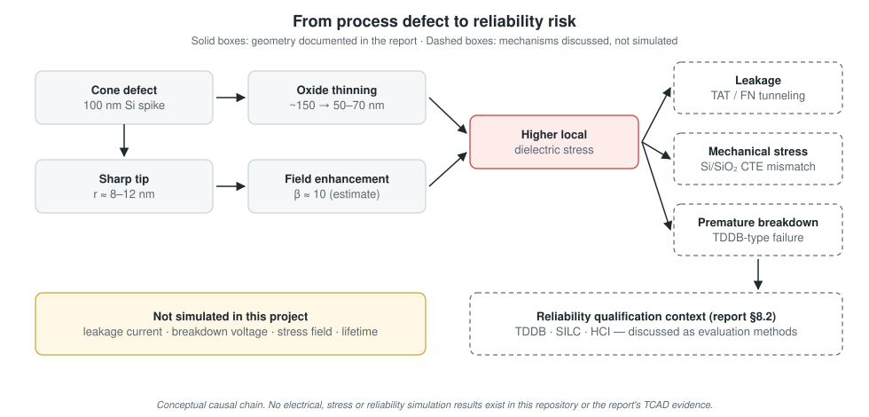

# Reliability Implications



> **Scope.** Every mechanism on this page is **discussed** in the project report as a consequence of the cone defect. None was **simulated**. No leakage current, breakdown voltage, stress value, or lifetime was computed.

## Causal chain

```
Cone defect
  → sharp tip (r ≈ 8–12 nm, reported)
  → electric-field enhancement (β ≈ 10, reported estimate)
      +
    oxide thinning (~150 → 50–70 nm, reported)
  → higher local dielectric stress
  → higher breakdown risk
  → potential leakage / reliability degradation
```

## Leakage mechanisms (discussed in report §6.2)

| Mechanism | Physics | Relevance to the cone |
|---|---|---|
| **Trap-assisted tunneling (TAT)** | Carriers tunnel through the oxide via defect states (traps); the rate rises with field and trap density | Higher local field at the tip, plus possible process-induced traps in thinned oxide |
| **Fowler-Nordheim tunneling (FN)** | Field-emission tunneling through a triangular barrier, J ∝ E² exp(−B / E) | Very steep in E, so a β-enhanced tip field can dominate the total leakage |

The report states that the higher tip field "greatly increases these currents", which could raise standby power and, in memory, cause retention failures. **Status: discussed, not simulated.**

## Mechanical stress (discussed in report §6.2)

- Si and SiO₂ have different thermal-expansion coefficients, so cooling after high-temperature steps leaves residual stress.
- The cone's shape concentrates that stress near the tip. The report describes **tensile stress in the oxide** near the tip and **compressive stress in the silicon**.
- Stress concentrations can generate interface states and accelerate stress-assisted dielectric breakdown.

**Status: interpretation, not simulated.** No stress values exist.

## Breakdown

The tip region combines the thinnest oxide with the highest field, so it is the most likely site for premature dielectric breakdown. The report also says the breakdown starts "at voltages far below the nominal breakdown voltage" (§1.4, §2.3). The report's §6.3 table gives specific breakdown voltages and lifetime ratios but no method, so they are not reproduced here (see [audit.md](audit.md)). **Status: discussed, not simulated.**

## Reliability context: qualification tests (report §8.2)

| Test | What it measures | Why the cone matters | Status here |
|---|---|---|---|
| **TDDB** (time-dependent dielectric breakdown) | Time to breakdown under constant high field and temperature | The locally enhanced field accelerates wear-out, so early TDDB failures are expected | Discussed as an evaluation method |
| **SILC** (stress-induced leakage current) | Leakage increase after electrical stress | Thinned oxide plus trap generation create leakage paths | Discussed as an evaluation method |
| **HCI** (hot-carrier injection) | Device degradation from energetic carriers near non-uniform fields | Field non-uniformity near STI edges | Discussed as an evaluation method |

## Yield context (report §8.1)

The report gives an illustrative calculation: with about 10⁸ isolation regions per chip and a defect rate of 1 per 10⁶ structures, there are about 100 defects per chip. It notes that yield falls exponentially with defect density (Poisson/Seeds models). This is illustrative arithmetic, not a project result.

## What would make this quantitative

- Device-level field extraction (see [electric-field-analysis.md](electric-field-analysis.md)).
- Tunneling and TAT models in Sentaurus Device to compute leakage against defect geometry.
- Thermal-mismatch stress simulation after fill and anneal.
- Field-acceleration TDDB models driven by the extracted peak field.
